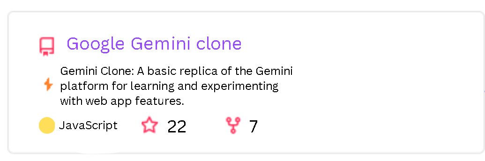
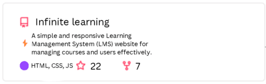

<code></code>
<code></code>
<code></code>
<code></code>
<code></code>

|  |  |
| ------------- | ------------- |

# My Projects

### Silkroad E-Books

### Google Gemini clone

### Infinite Learning

<code></code>
<code></code>
<code></code>

<picture>
  <source
    media="(prefers-color-scheme: dark)"
    srcset="https://raw.githubusercontent.com/platane/snk/output/github-contribution-grid-snake-dark.svg"
  />
  <source
    media="(prefers-color-scheme: light)"
    srcset="https://raw.githubusercontent.com/platane/snk/output/github-contribution-grid-snake.svg"
  />
  
</picture>
